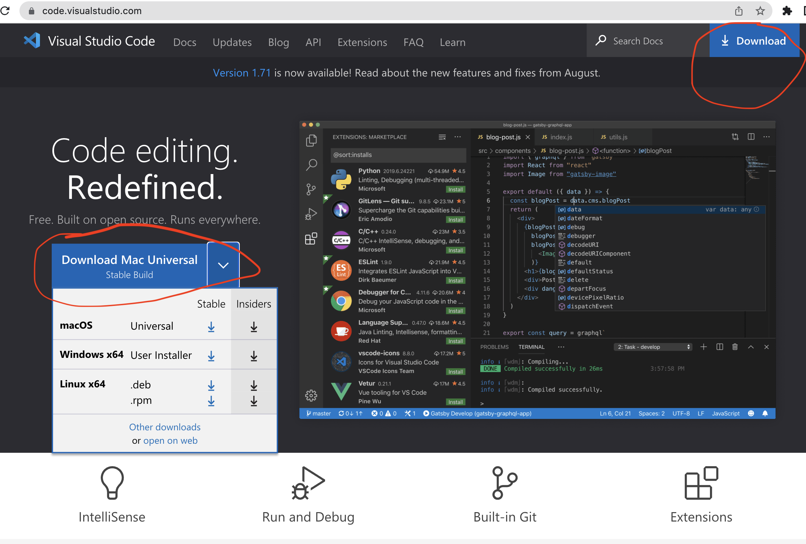
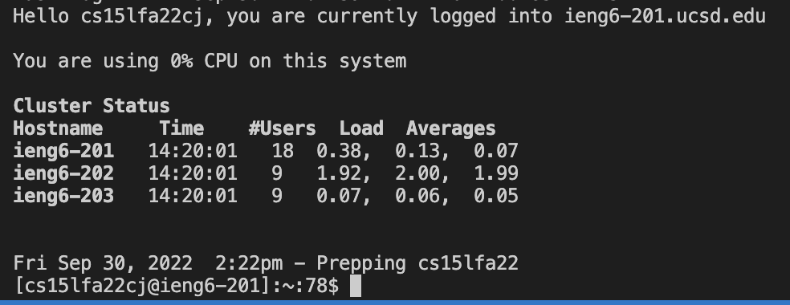
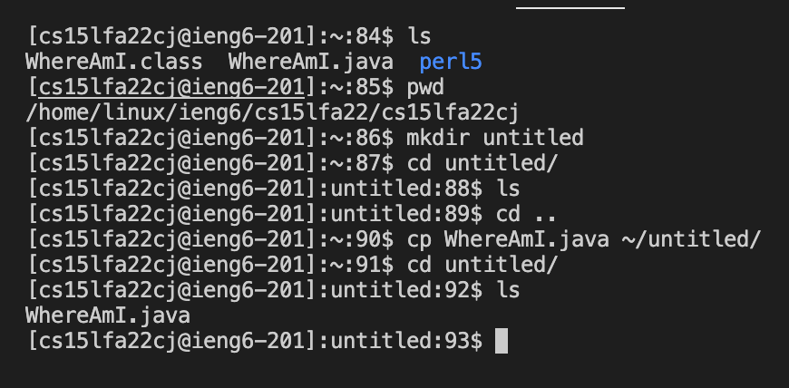
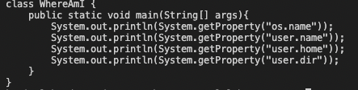
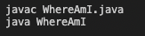
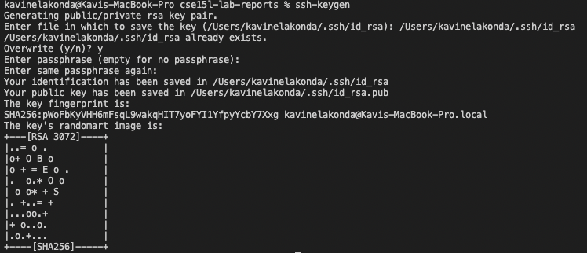
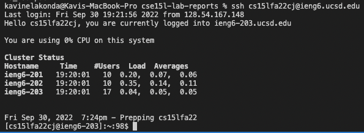
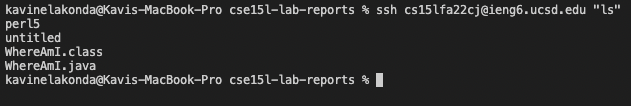
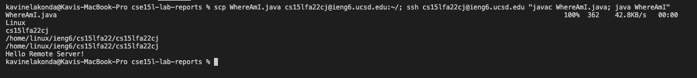

# Lab Report 1
## how to log into a course specific account on ieng6
### Step 1: Get your CSE15L Account
To find your CSE15L account go to [https://sdacs.ucsd.edu/~icc/index.php](https://sdacs.ucsd.edu/~icc/index.php)
You might need to reset your password. To do so, go  and follow  [these directions](https://docs.google.com/document/d/1hs7CyQeh-MdUfM9uv99i8tqfneos6Y8bDU0uhn1wqho/edit) 

### Step 2: Install VS Code
Go to [this link](https://code.visualstudio.com/) and install VS Code

Click the dropdown on the left or click the "Download" button on the top right for more options

### Step 3: Remotely Connecting
Before we remote connect, there is one step you need to do if you have a Windows computer: install [OpenSSH Client](https://learn.microsoft.com/en-us/windows-server/administration/openssh/openssh_install_firstuse?tabs=gui)

Now, it is time to go into the terminal in VS Code and remote connect.
type the command in the following picture, with the "cj" replaced by the two letters you found in step 1.

You will then be prompted if you want to continue connecting. Type "yes" and then hit "enter".
The terminal should now look like the picture below. You have connected to a computer in the CSE basement and can run commands on that computer.

### Step 4: Trying Some Commands
There are plenty of commands, such as `cd`, `ls`, `pwd`, `cp`, and `mkdir`. 
This is what they do when I am logged in:

I listed out the directories, then showed where my working directory is, made a directory(or folder) called "untitled", went into it, and listed out the files in it. There are no files, so I backed out of the directory, and then copied "WhereAmI.java" into "untitled". I then went back into "untitled" folder and listed out the files, which now has WhereAmI.java.

Some other useful commands to try (some of which I already did!):
* `cd ~`
* `cd`
* `cd ..`
* `ls -lat`
* `ls <directory> `where `<directory>` is something similar to `/home/linux/ieng6/cs15lfa22/cs15lfa22cj`, `cj` being different letters dependent on the person

### Steph 5: Moving Files with scp

The above commands were all for work locally, but now that we can access another computer remotely, we can transfer files between them. We'll create a java program first that helps show us where we are in our directories, and copy that file over from our local computer to the remote one.
We'll name the file `WhereAmI.java`

Here is the code:

To run this file, make sure you are in the directory where the .java file is located, and then, if you have java, type in terminal:

Now, let's copy the file that was just made to the remote computer we ssh'd into earlier. To do this, write the command:
`scp WhereAmI.java cs15lfa22cj@ieng6.ucsd.edu:~/`
Replace the cj with the letters from your username, and enter your password when prompted.

From here, `ssh` back into ieng6 like you did earlier, and type `ls`. You should see `WhereAmI.java` in the directory. Run the program with the java instructions from above. If you weren't able to earlier, you can do so now.
Your output should look different from when you ran the java program locally (if you could). The program is outputting the operating system type, the user name, and home directory name, and the current working directory name.

### Step 5: Setting an SSH Key

Since remote connecting to ieng6 servers takes a long time, we're going to create ssh keys to speed up the process moving forward. `ssh-keygen` will create a pair of files, public and private keys.
Follow the steps in the image below, ignoring the part about `Overwrite` (It should not appear when you run this program)

For people on Windows there would be an extra `ssh-add` step that can be followed [here](https://docs.microsoft.com/en-us/windows-server/administration/openssh/openssh_keymanagement#user-key-generation)

Now we are going to make a `.ssh` directory in the server and copy the public key there. `ssh` into the server and type the following:
> `mkdir .ssh`

Then go back into your client, type the following command (replace `/Users/kavinelakonda/.ssh/id_rsa.pub` with the user path)
> `scp /Users/kavinelakonda/.ssh/id_rsa.pub cs15lfa22cj@ieng6.ucsd.edu:~/.ssh/authorized_keys`

Now when you try to `ssh` or `scp` into the server, you will not be prompted for the password. Here is an example of me trying to `ssh` into the server. Notice, I am not prompted for a password anymore!

### Step 6: Optimizing Remote Running

Let's say you changed `WhereAmI.java` locally, but want to run it on the remote server. There are some ways to write commands in terminal to better and faster:
* by adding quotes around a command at the end of an `ssh` command, the command will be executed after logged into the remote server. Here is an example:

I `ssh`'d into the remote server and listed out the files, and notice that I am still not logged in.

* If I add semicolons after each command, I can execute multiple commands at the same time. I can try combining this with the quotes to copy and run the edited `WhereAmI.java` file all in the same line! See if you can do it yourself, and look in the picture below for the answer.

